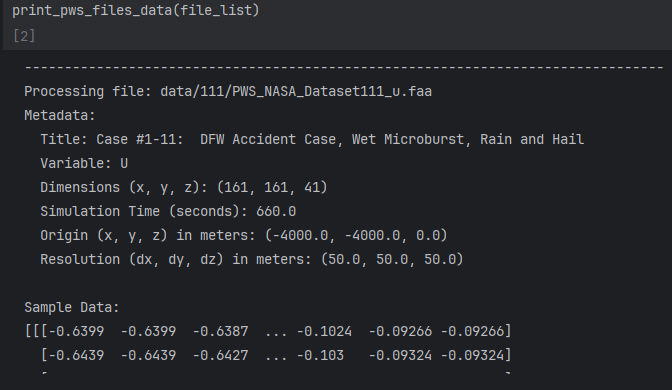
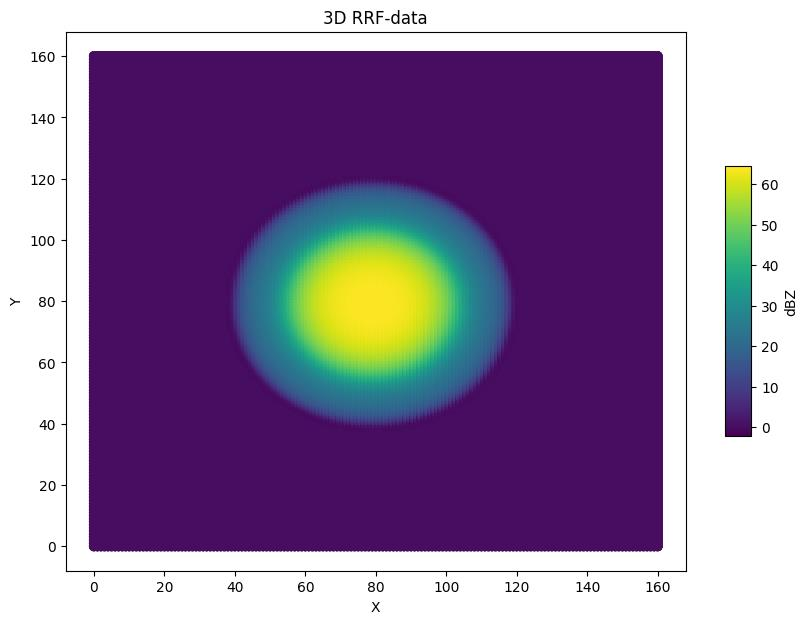
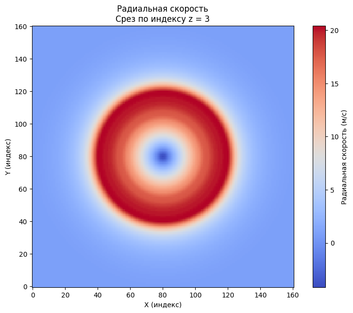
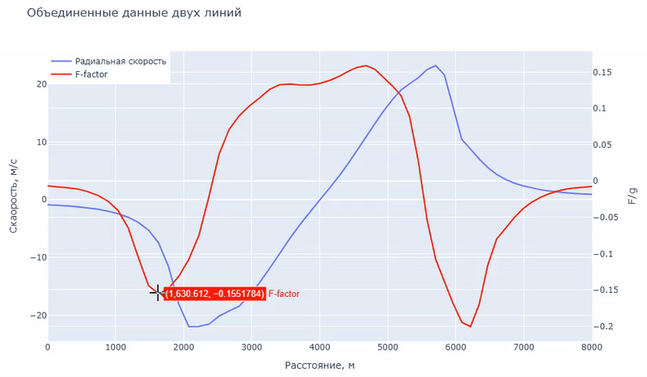
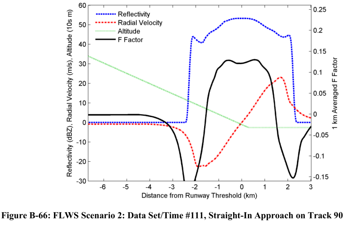
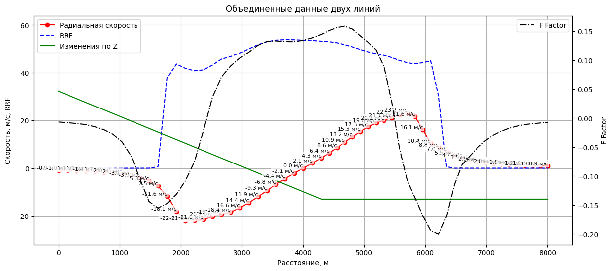

# Разработка идентификатора радиолокационных данных метео РЛС

[📖 Инструкция по настройке и запуску проекта](#настройка-проекта-meteo_rls)

---

**МИНИСТЕРСТВО НАУКИ И ВЫСШЕГО ОБРАЗОВАНИЯ РОССИЙСКОЙ ФЕДЕРАЦИИ**  
федеральное государственное автономное образовательное учреждение высшего образования  
**Санкт-Петербургский политехнический университет Петра Великого**  
ИНСТИТУТ СРЕДНЕГО ПРОФЕССИОНАЛЬНОГО ОБРАЗОВАНИЯ  

**Специальность:** 09.02.07 Информационные системы и программирование  
**Уровень подготовки:** программист 

**ВЫПУСКНАЯ КВАЛИФИКАЦИОННАЯ РАБОТА**  

## Тема: Разработка идентификатора радиолокационных данных метео РЛС для АО «Навигатор»

---

### ЦЕЛЬ ПРОЕКТИРОВАНИЯ

Цель проектирования — разработать программное обеспечение для автоматизированного анализа трёхмерных радиолокационных данных с целью выявления опасных метеоявлений (таких как турбулентность и сдвиги ветра).

Это позволит повысить безопасность авиационных операций за счёт оперативного прогнозирования неблагоприятных погодных условий.

---

### ЗАДАЧИ ПРОЕКТИРОВАНИЯ

Для реализации данной цели необходимо решить следующие задачи:

*   **Анализ предметной области**
    *   Изучить принципы работы радиолокационных систем (РЛС);
    *   Определить методы расчета радиальной скорости и F-фактора, а также требования к визуализации.
*   **Разработка программного обеспечения**
    *   Реализовать модуль для чтения и обработки трёхмерных массивов данных из файлов PWS (Performance Work Statements);
    *   Реализовать алгоритмы расчета радиальной скорости, трилинейной интерполяции и F-фактора ветрового сдвига.
*   **Визуализация результатов вычислений**
    *   Визуализация срезов через трёхмерный куб данных, распределения радиальной скорости, RRF и F-фактора вдоль произвольных траекторий с использованием matplotlib и Plotly.
*   **Тестирование**
    *   Проверка корректности работы модулей.

---

### ОБЗОР СРЕДСТВ РАЗРАБОТКИ

Разработка программного обеспечения осуществлялась в среде Visual Studio Code с использованием языка Python.

**Среда разработки и технологии:**
*   Среда: Visual Studio Code;
*   Язык программирования: Python.

**Основные использованные библиотеки:**
*   NumPy (численные расчёты и массивы);
*   Matplotlib (визуализация данных);
*   Plotly (интерактивная визуализация данных);
*   Jupyter Notebook (корректное отображение графиков, удобство в отладке).


| | | | |
|---|---|---|---|
|  |  |  |  |

---

### ФУНКЦИИ СИСТЕМЫ

Программное обеспечение должно выполнять следующие функции:

*   Чтение и обработка данных из файлов PWS (Performance Work Statements - отчеты о проделанной работе);
*   Расчёт радиальной скорости ветра;
*   Трилинейная интерполяция значений в кубе данных;
*   Расчёт F-фактора для идентификации опасных метеорологических явлений;
*   Визуализация полученных результатов.

---

### СЧИТЫВАНИЕ ДАННЫХ

|  |  |
| :--- | :--- |
|    **Метаданные:**<br>    -   Заголовок, переменная, размерности сетки (x, y, z)<br>    -   Время симуляции, координаты начала области моделирования (`origin_m`)<br>    -   Шаг дискретизации (`resolution_m`)<br>   **Пример:**<br>    -   Файл `Dataset111_u.faa` показал параметры:<br>        -   Размерность сетки: 161×161×41<br>        -   Начальная точка: (-4000, -4000, 0)<br>        -   Шаг: 50 м<br>*   **Валидация данных:**<br>    -  Вывод фрагментов массивов подтвердил отсутствие аномалий, например, нулевые значения на границах.<br>    -   Визуализация подтвердила корректность структуры и отсутствие смещений. |  |

---

### ПРОВЕРКА РАСПРЕДЕЛЕНИЯ ОТРАЖАЕМОСТИ

|  |  |
| :--- | :--- |
|  |    **Метод визуализации:**<br>    2D-визуализация RRF (Radar Reflectivity Factor) с использованием matplotlib, точечная диаграмма с цветовой шкалой по dBZ.<br>  **Анализ:**<br>  -  Количество точек координат по осям графика корректно (160).<br>    -  Пики RRF в центре матрицы согласуются с ожидаемыми гидрометеорами.<br>    -   Отсутствие артефактов (разрывы/аномалии). |

---

### РАСЧЕТ РАДИАЛЬНОЙ СКОРОСТИ

|  |  |
| :--- | :--- |
|    **Алгоритм:**<br>    Координаты заданы в соответствии с центром координатной сетки.<br>    -   Координатные сетки основаны на метаданных, считанных из файлов PWS (начало области, шаг дискретизации, размерности).<br>    -   Расчет расстояния до каждой точки сетки, дальнейший расчет радиальной скорости по формуле.<br>  **Визуализация:**<br>    -   2D-срезы представлены в цветовой гамме `coolwarm`, где красное соответствует движению от наблюдателя.<br>   **Результаты:**<br>    -   Логичное распределение: центральная область соответствует высокой скорости (восходящие потоки).<br>    -   Отсутствие артефактов соответствует физическим моделям. |  |

---

### ТРИЛИНЕЙНАЯ ИНТЕРПОЛЯЦИЯ

|  |  |
| :--- | :--- |
|  |    **Метод:**<br>    -   Триллинейная интерполяция представляет собой метод вычисления значения внутри трёхмерной регулярной сетки на основе взвешенного среднего значений её ближайших соседних.<br>    -   Данный подход позволяет обеспечить гладкость переходов между дискретными узлами и корректно извлекать данные в произвольных точках внутри объёмного поля.<br> **Тест:**<br>    -   Точка наблюдателя расположена в координатах (-4500, -4500, 150) за границами.<br>    -   Азимут составляет 45°, а угол места — 4°, что отображается на 3D-графике.<br>  **Результаты:**<br>       Результаты показали корректное обрезание линий за границами области данных и отсутствие скачков значений между соседними точками. |

---

### РАСЧЕТ F-ФАКТОРА

|  |  |
| :--- | :--- |
|    **Алгоритм:**<br>    -   Градиент радиальной скорости вычисляется с использованием функции `np.gradient`.<br>    -  Скользящее окно размером 1 км обеспечивает усреднение ускорения.<br>    -   Нормировка проводится на значение $g = 9.81 \text{ м/с}^2$.<br>   **Валидация:**<br>    -   Корреляция F-фактора с пиками скорости совпадает со сдвигами ветра.<br>    -   Устойчивость к шуму обеспечивает усреднение в окне.<br>    -   Калибровка проводится по ускорению свободного падения.<br>  **Графики:**<br>       Двойная ось Y используется для отображения радиальной скорости синим цветом и F-фактора красным цветом. |  |

---

### ОБЪЕДИНЕНИЕ ДАННЫХ И ПРОВЕРКА

**Вводные данные:**<br>       Данные вдоль двух траекторий, полученных при моделировании сдвига ветра в условиях посадки воздушного судна.<br>   **Параметры:**<br>    -   Точка наблюдателя расположена на координатах (-6996, 0, 382 м), что соответствует 3.8 км до порога ВПП.<br>    -   Азимут составляет 0°, угол места -3° (в соответствии с глиссадным спуском).<br>    -   Вторая траектория представляет собой горизонтальное сканирование (0°/0°) вдоль ВПП.<br>   **Визуализация:**<br>    -   На левой Y-оси отображаются радиальная скорость (красный пунктир), RRF (синий пунктир) и высота (зелёная линия).<br>    -   На правой Y-оси представлен F-фактор (чёрная линия).<br>    -   Эталонные значения сценария. 

 

---

### ОБЪЕДИНЕНИЕ ДАННЫХ

Объединенный график с радиальной скоростью, RRF, изменением высоты и F-фактором.



---

### ЗАКЛЮЧЕНИЕ

В ходе выполнения дипломного проекта были успешно решены все поставленные задачи:

*   Проведён анализ предметной области.
*   Спроектирован алгоритм обработки радиолокационных данных.
*   Разработана программа для комплексного анализа и визуализации данных.
*   Реализованы функции для расчёта радиальной скорости ветра и F-фактора.
*   Написаны и протестированы скрипты для визуализации результатов.

Поставленные задачи выполнены, цель дипломного проекта достигнута.

Разработанная программа обеспечивает корректную обработку радиолокационных данных, их визуализацию и анализ, что подтверждает её эффективность и готовность к последующей адаптации для работы на ПЛИС и применения в реальных эксплуатационных условиях.

---

<br>
<br>
<br>

# Настройка проекта Meteo_RLS

Этот документ содержит инструкции по настройке и запуску проекта Meteo_RLS.

## Требования

- Python 3.12 или выше
- pip (установщик пакетов Python)
- Git

## Установка и настройка

### Клонирование репозитория

1. Откройте командную строку (Command Prompt) или PowerShell (для Windows) или терминал (для Linux).
2. Клонируйте репозиторий:

    ```sh
    git clone https://github.com/DmitryZSer/Meteo_RLS.git
    ```
3. Скачайте файл с данными по ссылке: [data](https://disk.yandex.ru/d/C-NLYkAdBLL2aQ)

4. Распакуйте скачанный архив в директорию проекта (Пример правильного расположение: Meteo_RLS/data/111/PWS_NASA_Dataset111_u.faa)

5. Перейдите в директорию проекта в коммандной строке:

    ```sh
    cd Meteo_RLS
    ```

### Для Windows

1. Создайте виртуальное окружение:

    ```sh
    python -m venv .venv
    ```

2. Активируйте виртуальное окружение:

    ```sh
    .venv\Scripts\activate
    ```

3. Установите зависимости:

    ```sh
    pip install -r requirements.txt
    ```

4. Запустите Jupyter Notebook:

    ```sh
    jupyter notebook
    ```

5. Перейдите в браузере по адресу [http://localhost:8888](http://localhost:8888).

### Для Linux

1. Создайте виртуальное окружение:

    ```sh
    python3 -m venv .venv
    ```

2. Активируйте виртуальное окружение:

    ```sh
    source .venv/bin/activate
    ```

3. Установите зависимости:

    ```sh
    pip install -r requirements.txt
    ```

4. Запустите Jupyter Notebook:

    ```sh
    jupyter notebook
    ```

5. Перейдите в браузере по адресу [http://localhost:8888](http://localhost:8888).

## Запуск проекта

После выполнения вышеуказанных шагов, проект будет доступен в Jupyter Notebook. Откройте необходимый файл и следуйте инструкциям в блокноте для дальнейшей работы с проектом.

## Примечания

- Убедитесь, что у вас установлены все необходимые зависимости, указанные в файле `requirements.txt`.
- Если у вас возникли проблемы с установкой зависимостей, попробуйте обновить pip до последней версии:

    ```sh
    pip install --upgrade pip
    ```

- Для деактивации виртуального окружения используйте команду:

    ```sh
    deactivate
    ```
